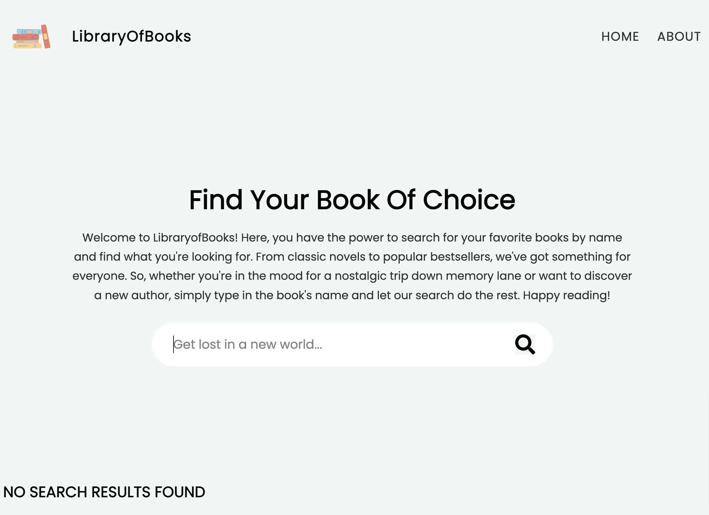
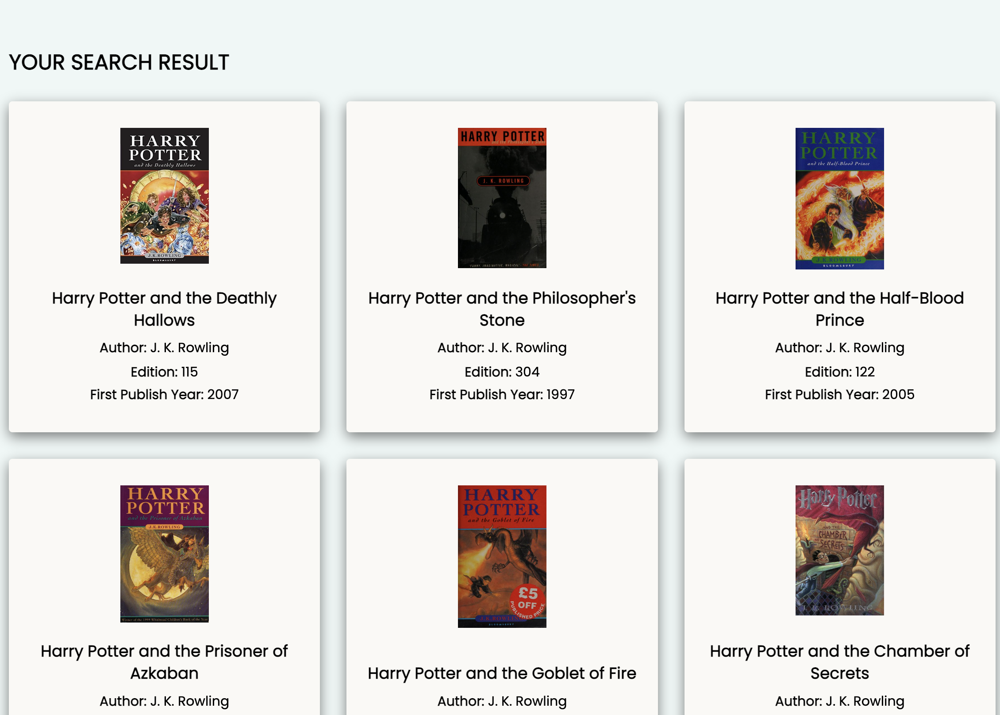
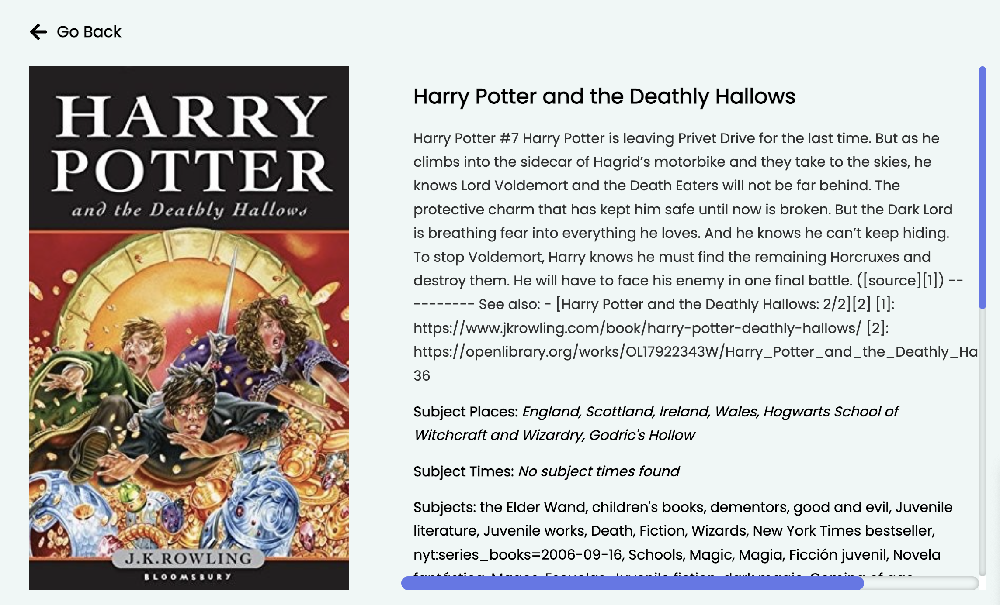

# Books API

---

## Demo & Snippets

---

## Requirements / Purpose

### MVP

Create a React project that will allow the user to search for a book using the search bar and read more information about the chosen book displayed in the selection.

The project should include:

1. A search form that allows users to enter a book title and submit the search request.
2. Create an API request using axios or fetch to retrieve the search results based on the user's input.
3. Display the seach results in a list format with relevant details such as the book title, author, and cover image. Each result should be clickable and lead to a detailed book page.
4. Create a detailed book page that displays all relevant information about the book.
5. Use styled-components to add CSS styling to the search form, search results, and detailed book page. The design should be responsive for both desktop and mobile.
6. Implement React Router Dom to allow users to navigate between the search form, search results nad detailed book page without reloading the page.

### Purpose of Project

The purpose of the project is to allow users to search for books based on specific criteria, such as author or title, and display the search results in an intuitive and visually appealing way. The project uses an API to retrieve book data from a database, which is then displayed to the user using React components and CSS styling.

### Tech stacks used:

React: provides a component-based architecture that makes it easy to create reusable UI components, which can be combined to create complex and dynamic user interfaces. React also offers features such as virtual DOM and efficient rendering, which help to optimize performance and speed up development.

CSS: provides a wide range of styling options, such as layout, typography, and color, which can be used to create visually appealing designs that enhance the user experience.

Javascript: a versatile language that can be used for everything from adding interactivity to a web page to creating complex web applications. In the case of the book search API project, JavaScript is used to make API requests and manipulate the data returned by the API to display it to the user.

---

## Build Steps

### Prerequisites

To get started, you will need to have Google Chrome and Visual Studio Code installed on your system.

### Steps:

Here are the steps to set up the project:

1. Clone the repository to your local machine.
2. Open the repository in visual studio code.
3. Navigate to "books-api" using the Command Line Interface (CLI) and run "npm install" to install the necessary dependencies, followed by "npm run dev" to start the development server.
4. Open the Google Chrome browser and copy the local link provided in the command line into the browser search bar to view the application. Alternatively, press the link directory in the command line to open the browser holding "cmd" on mac or "ctrl" on windows whilst clicking the link.

---

## Design Goals / Approach

The goals of the project was to create an application that focused on the user's needs and goals in which the user interface should be designed in a way that allows users ot easily search for books, view book details, and navigate between pages.

The design was kept minimal so that it is simple and easy to understand and unnecessary features and functionality should be avoided to keep the interface clean and clutter-free.

Additionally, the design was created to work on a variety of devices and screen sizes.

---

## Features

- Responsive design: Ensuring that the portfolio is optimised for different screen sizes and devices, so viewers can easily access and navigate the website on desktop and mobile devices (with a hamburger menu)
- Search functionality: The ability to search for books based on title.
- A loading animation that occurs when search is in process.

---

## Known issues

- Data for some books do not show as it is nested in a different object to other books.

---

## Future Goals

- Add pagination to navigate between pages of results.
- Add more error handling.
- User authentication to save search history or favourite books.
- User feedback so users can provide comments or ratings on books.

---

## What did you struggle with?

- I struggled with fetching the API data as there was some data for certain books that were nested differently to others.
- Creating the mobile menu was quite difficult to acheive as it wasn't displaying as required.
- The loading animation took some time to understand and implement.

---

## Further details, related projects, reimplementations

---

## Contact

Feel free to reach out to me via ashleykouch99@gmail.com for any questions or collaboration opportunites.
